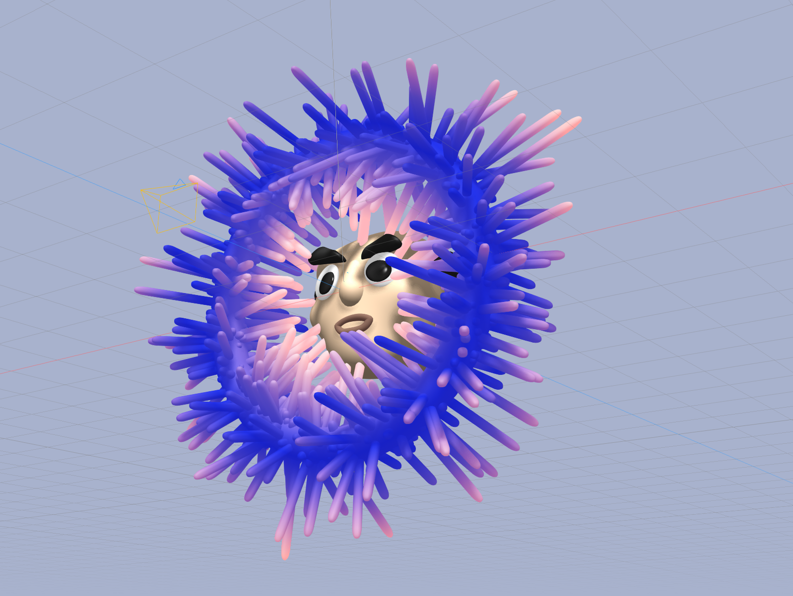
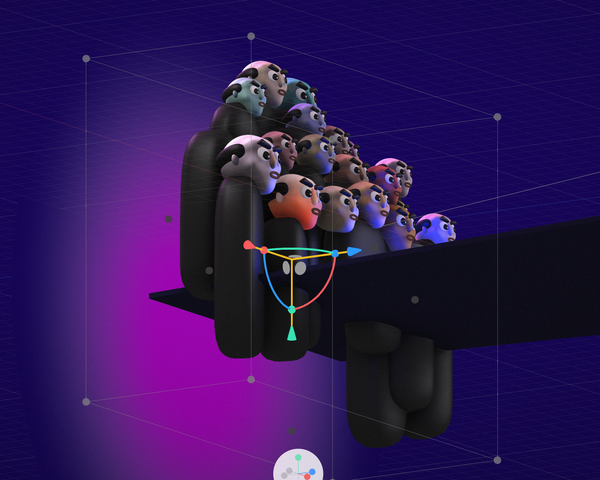
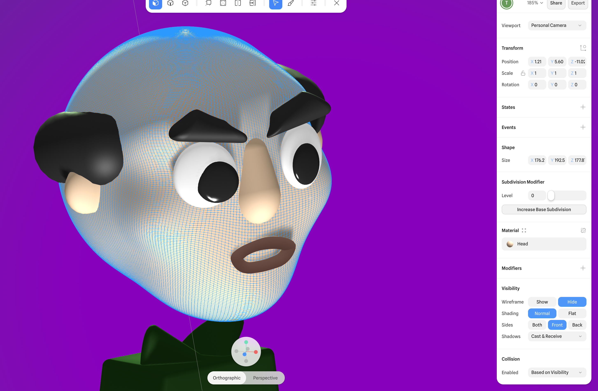
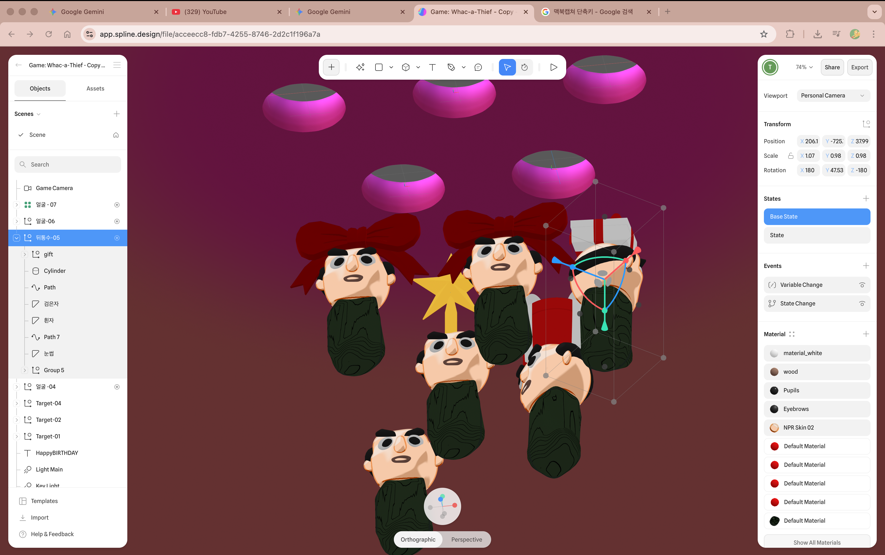
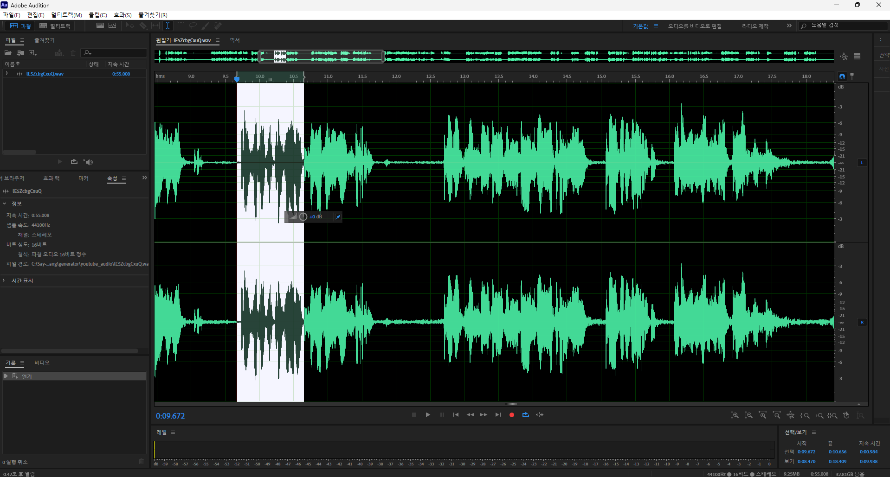
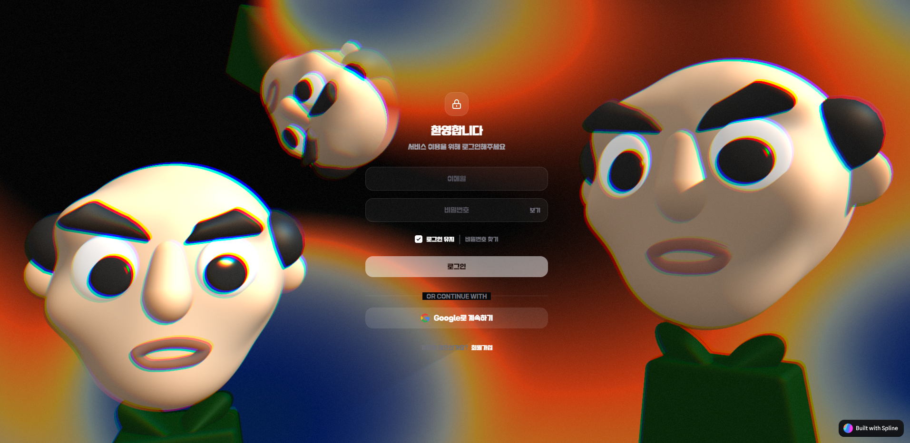
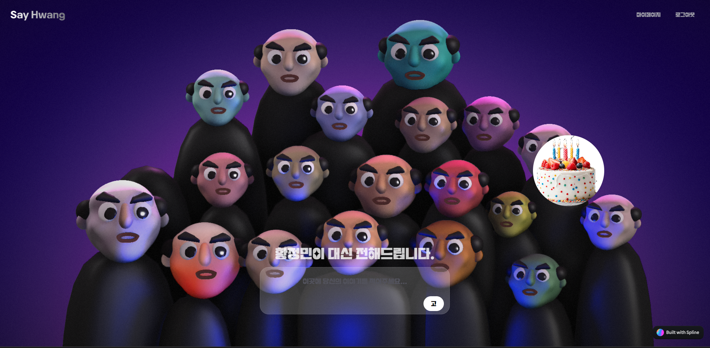
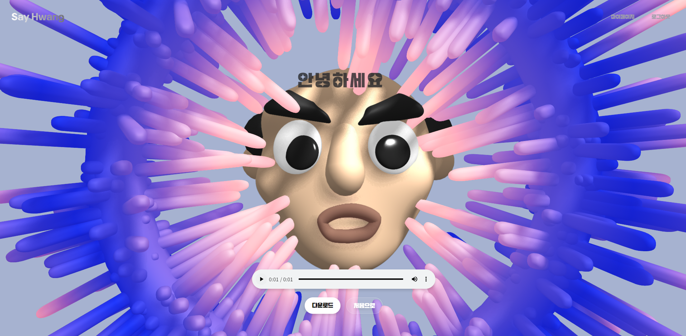
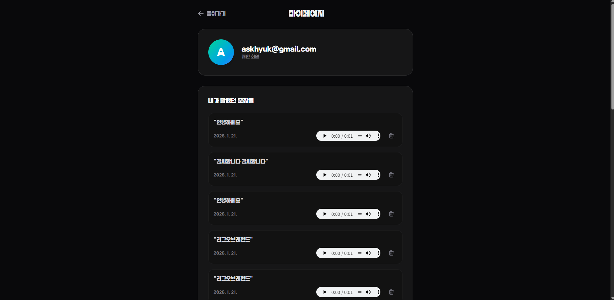

# [Project] Say Hwang (황정민이 대신 전해드립니다)

## 메인 포스터

---

## Who Made This!!!!

| **문의혁** | **서초우** |
| :---: | :---: |
|  |  |
| **KAIST** | **DGIST** |
| 음성합성엔진개발 | 전두광모델링 |

---

## [황정민-밤양갱] - 제프프
[](https://youtu.be/mUDFLe3Q__U?si=xlRFidf9LtFYAKws)
*(이미지를 클릭하면 유튜브 영상으로 이동합니다)*

---

## 세이 황 경험하기 (How to Use)
**KCLOUD 이용자 분들께**

1. 와이파이 `welcome KAIST` 연결
2. KCLOUD 로그인!
3. 아래 주소로 접속
> **http://172.10.5.67:80**

---

## 1. 프로젝트 개요 (Overview)
- **한줄 소개:** 배우 황정민의 목소리를 재현하는 **TTS(Text-to-Speech) 웹 애플리케이션**
- **개발 배경:** 단순한 기계음 TTS가 아닌, 영화 속 황정민 배우의 말을 오려서 붙인 오디오 생성 웹

---

## 2. 주요 기능 및 UX (Key Features)

### Spline ⇒ 3D 디자인 툴
**하나하나 빚어서 완성.**





**음성편집도 하나하나……. 자연스럽게**

- AI가 단어별로 잘라주지만 자연스러운 음성을 위해선 50ms의 공백도 부자연스럽게 만들 수 있어 수작업이 필수.

### 1. 랜딩 페이지

- 황정민 클릭시 윙크하는 애니메이션 추가

### 2. 로그인 및 회원가입 화면

- 구글 로그인 제공, 이메일로도 가입가능
- 마우스 커서들을 리틀정민(황정민 3D모델)들이 바라보는 반응형 배경 웹 구성

### 3. 메인페이지

- text 입력 후 **고** → 나만의 대사 생성 page

- 입력받은 대사로 생성한 멘트 재생, 재생과 함께 하이라이트 되는 자막
- 음성 다운로드 가능
- 줌으로 배경 확대/축소 가능, 클릭으로 배경 회전 가능

### 4. 생일 페이지

- 이름 입력, 입력시 이름을 넣어 생일 축하 음악을 생성하여 재생

### 5. 마이페이지

- 마이페이지에서 생성했던 음성들 다시 재생 및 삭제 가능

### 🎯 주요 기능 요약
- **🎙️ 나만의 대본 생성:** 사용자가 입력한 텍스트를 황정민 목소리를 조합한 음성으로 실시간 생성.
- **🎵 노래방 스타일 자막 (Lyrics Sync):** 백엔드에서 생성된 `timing_data`를 기반으로, 오디오 재생 시점과 텍스트 하이라이트를 1:1로 동기화.
- **🧊 몰입형 3D 인터페이스:** `Spline` 3D 모델을 적용하여, 정적인 웹이 아닌 생동감 있는 인터랙티브 배경 제공.
- **☁️ 클라우드 저장 및 공유:** `Supabase` 연동으로 생성된 오디오를 영구 저장하고, 친구들에게 링크로 공유 가능.

---

## 3. 핵심 기술 (Core Technology)

**⇒ new 기술을 만듬**
우리의 소스는 수작업이다. 우리는 그것을 자동화시키기로 했다.

# **“음성 합성 엔진”**

### A. 데이터 수집 → Microsoft azure로 데이터 추출
→ 파일, 단어, CHILDREN(각 음), 그리고 영상 내 타임스탬프 추출

```json
{
    "word": "하면",
    "start_ms": 2560.0,
    "syllables": [
        {
            "text": "하",
            "start_ms": 2560.0,
            "duration_ms": 100.0
        },
        {
            "text": "면",
            "start_ms": 2670.0,
            "duration_ms": 130.0
        }
    ]
}
```


> 💡 **시작**
>
> ## 서초우, 문의혁

### B. 음소 단위 분해 및 분석 (Phoneme Analysis)

- **텍스트 정규화:** `g2pk` 라이브러리를 활용하여 입력된 문장을 한국어 발음 기호로 변환한다.
    > “문의혁” → 무 늬 역

- **음소 분리:** `jamo`를 사용해 자음/모음 단위로 미세하게 분해하여 처리 단위를 최소화한다.
    > “서초우” →  ㅅ ㅓ ㅊ ㅗ ㅇ ㅜ
    >
    > “문의혁” → ㅁ ㅜ ㄴ ㅇ ㅡ ㅣ ㅎ ㅕ ㄱ

### C. 벡터 기반 유사도 매칭 (Vector Similarity Matching)

- **한정된 시간/원본 한에서 모든 글자를 모으는건 불가능 (이 프로젝트는 약 220개 수집함)**
- **음성 DB 검색:** 배우의 기존 음성 데이터베이스에서 입력된 음소와 일치하는 파형을 검색합니다.
- **유사 발음 대체 알고리즘:** 정확히 일치하는 음성이 없을 경우, 자체 개발한 대체 글자 추천 엔진이 작동합니다.
    - *원리:* 한글 발음에는 모음, 자음, 받침 순으로 영향을 크게 미침. 또한 비슷한 발음들끼리는 ex(ㅐ,ㅔ)  발음 차이가 크게 없는 점을 고려해 가중치를 부여하여 가장 유사한 단어를 찾음.
    - *예시:* '각'이라는 소스가 없다면, ㄱ과 비슷한 ㅋ를 초성으로 하는 ‘칵’이 음소 모음에 있다면 대신 ‘칵’ 을 사용

### D. 접두사/접미사 검색 (Similarity Matching)

- **접두사/접미사 검색:** 접두사/ 접미사는 발음이 길어서 분리가 쉽고, 발음시 중요도가 높기 때문에 전체 대사 목록에서 공통 접두사/접미사를 찾아서 발음함.

- **접두사/접미사 검색 우선순위:** 우선 최대 공통접두사를 찾은 다음, 남은 부분중 최대 공통접미사를 찾은 다음, 중간은 벡터 기반 유사도 매칭으로 한글자 씩 발음해서 단어 발음을 완성함

    > **“감사합니다”**
    >
    > 영화 대사 내 존재하는 가장 긴 단어 : “감사”, “니다” ⇒ 통채로 들고오기
    > “합”을 찾아 “감사” + “합” + “니다”로 음성파일을 완성

### E. 오디오 접합 및 후처리 (Audio Stitching & Post-processing)

- **Concatenative Synthesis(연결 합성) 개선:** `pydub`과 `ffmpeg`를 사용하여 수십 개의 오디오 조각을 이어 붙인다.
- **자연스러운 흐름:** 조각 간의 이질감을 없애기 위해 **Crossfade(교차 편집)** 및 **Normalization(볼륨 평준화)** 기술을 적용하고, 문맥에 맞는 속도 조절(Rhythm Adjustment)을 수행한다.

## 4. 기술 스택 (Tech Stack)

### 🎨 Frontend (Client-side)

- **Core:** `React 19`, `TypeScript` (안정성과 최신 기능 활용)
- **Build Tool:** `Vite` (빠른 개발 환경 구축)
- **Styling:** `TailwindCSS v4` (최신 유틸리티 CSS 적용)
- **3D Interaction:** `@splinetool/react-spline` (웹 3D 구현)

### ⚙️ Backend (Server-side)

- **Language:** `Python`
- **Framework:** `Flask`
- **Audio Processing:** `ffmpeg`, `pydub` (오디오 편집/합성)
- **NLP & Phonetics:** `g2pk`, `jamo`, `KoreanPhoneticVectorizer`

### 🏗️ Infrastructure & Database

- **BaaS:** `Supabase` (Auth, Database, Storage 통합 관리)
- **Database:** `PostgreSQL` (메타데이터 관리)
- **Storage:** `Supabase Storage` (생성된 MP3 파일 호스팅)

---

## 🎵 개발 스택

- **개발 언어 :** JS/Python
- **Frontend:** REACT
- **Backend:** Flask
- **UI/UX :** Spline
- **데이터 정리 :** Python/Microsoft Azure Speech